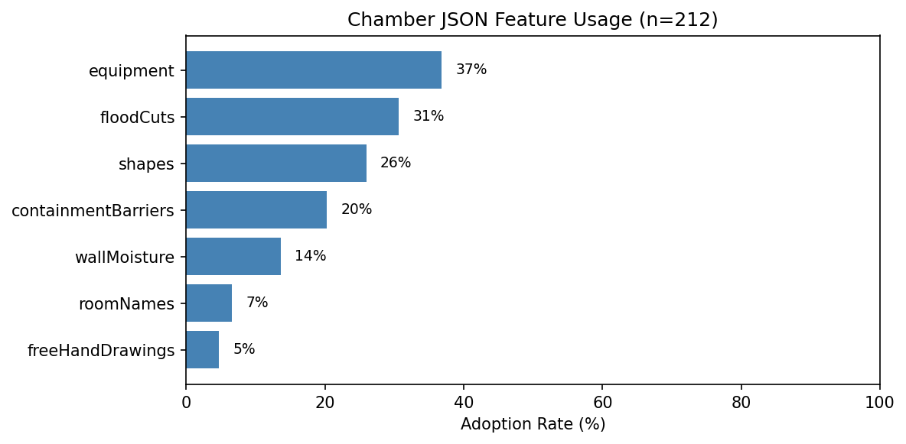
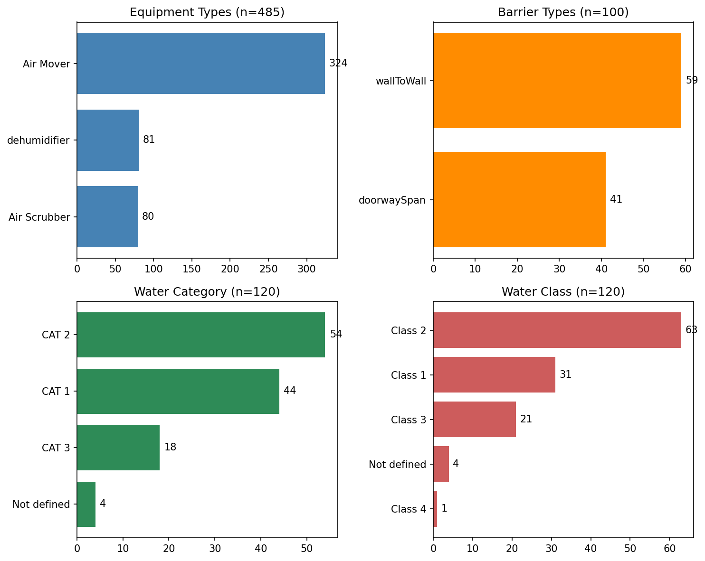

# 01 — Charlie Koster: Raw iOS Data Analysis

- **Date:** January 28–30, 2026
- **Author:** Charlie Koster
- **Channel:** `#estimate_strategist_team_public`

---

## Context

This is the starting point of the data contracts work. Before any FE JSON format existed, Charlie analyzed the raw data coming out of the **Instant Sketch iOS app** — the LiDAR-based room scanning tool used by water damage restoration technicians in the field.

Charlie exported 14 days of TestFlight analytics from Mixpanel (212 chamber events from 21 unique testers across 7 countries) and produced a thorough breakdown of the `chamber_json` payload structure, feature adoption rates, and data quality observations.

This analysis established **what data exists on the mobile side** and informed the contract negotiations that followed with Anton (Team B).

---

## Files

### `data-report.md`

The main analysis report covering:

- 212 chamber events from 21 beta testers (top 3 users drove 58% of all events)
- Schema structure of `chamber_json` — top-level keys, 4 distinct schema variants
- Feature adoption rates: Equipment (37%), Flood Cuts (31%), Shapes (26%), Containment Barriers (20%), Wall Moisture (14%)
- Equipment breakdown: Air Movers (67%), Dehumidifiers (17%), Air Scrubbers (16%)
- Water classification: only 57% of records include `waterCategory`/`waterClass` (schema addition mid-test)
- Room scan complexity: average 15 walls, 17 objects, 3 doors per LiDAR scan
- 81% of chambers use the default name "First Drying Chamber"

### `primary-analysis.ipynb`

Jupyter notebook with the full analysis code and visualizations that generated the report.

### `export-2026-01-28-104135 (1).csv` *(git-ignored — 3.6MB)*

Raw Mixpanel CSV export containing all 212 chamber events. Not tracked in git due to size — available on request.

### `First_Drying_Chamber_2026-01-28_121556.pdf` *(git-ignored)*

Sample PDF export of a single drying chamber scan, used for the floor area polygon calculation (93.89 m² / ~1,011 sq ft).

### `demo.mp4` *(git-ignored — 67MB)*

Video demo of the Instant Sketch app in action. Not tracked in git due to size — available on request.

### `chamber_feature_usage.png`

Bar chart showing adoption rates of each annotation feature across all 212 chambers (equipment, flood cuts, shapes, containment barriers, wall moisture, room names, freehand drawings).

### `chamber_value_distribution.png`

Distribution charts for equipment types, barrier types, water category/class, and other categorical values across the dataset.

### `charlie-koster-msg-inf.png`

Screenshot of Charlie posting the analysis materials to `#estimate_strategist_team_public`. The thread shows a rendered floorplan image and discussion about the data. This establishes the provenance of the raw data analysis.

---

## Key Takeaways for Contract Work

1. The iOS app produces rich LiDAR data but with **inconsistent schema** — 4 variants existed during the test period, meaning the converter (Anton's side) must handle variability.
2. `waterCategory`/`waterClass` was added mid-test — only 57% of records have it. This later became a bug that was fixed in the mobile app (see folder 03).
3. Equipment is the most-used annotation (37%) — making `roomId` association critical for the estimate engine.
4. Wall moisture has low adoption (14%) but high density when used (4.9 items per chamber) — important for accurate line item generation.
